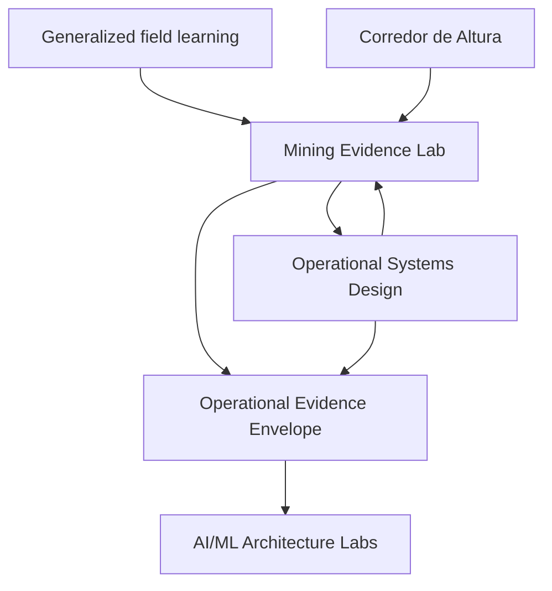

# Architecture

## Role

Mining Operational Evidence Lab is the mining-domain translation layer in Martin Conti Graffigna's system-of-systems portfolio.

It converts generalized field observations into:

1. domain questions;
2. synthetic operational scenarios;
3. explicit event and state contracts;
4. evidence envelopes with provenance;
5. governed decision-support inputs;
6. documented findings and limitations.

It does not reproduce employer systems or claim operational authority.

## Dual-audience architecture

The project separates the person evaluating the portfolio from the persona represented inside the system.

| Layer | Primary audience | Need |
|---|---|---|
| Public portfolio | Client, recruiter, or interested company | Inspect credible evidence of sustained systems thinking and domain translation |
| Synthetic use case | Incoming supervisor | Understand work-front state, evidence gaps, blockers, ownership, and next actions quickly |

The external audience evaluates the architecture and evidence. The synthetic supervisor exercises the design. Neither audience changes the repository's non-deployment and non-authority claims.

## Professional evidence proposition

The portfolio value comes from the traceable chain:

**field experience → sanitized domain question → synthetic model → executable evidence → documented limitation → cross-repository integration**

This chain demonstrates orchestration and creative systems design. It avoids treating either code volume or employment history as sufficient proof on its own.

## System context

- **Generalized field learning** supplies questions, failure modes, and vocabulary after sanitization.
- **Corredor de Altura** can supply synthetic or public geospatial context in future cases.
- **Mining Evidence Lab** owns domain scenarios and mining-specific contracts.
- **Edge Operational Evidence System** owns capture, integrity, reliability, and provenance patterns.
- **AI/ML Architecture Labs** owns governed consumption, refusal, and decision-brief patterns.
- **Operational Systems Design** owns portfolio-level architecture, interface governance, and synchronization.

## First bounded context: shutdown handover

The first case represents a handover as a sequence of state assertions, evidence references, blockers, and next actions.

### Decision record for M1

- The canonical handover unit is a **work front**.
- A work front may contain multiple tasks and dependencies.
- The first operational persona is an **incoming supervisor**.
- The first value test is whether the model separates **reported**, **evidence-supported**, **pending**, **conflicting**, and **unknown** states.
- The public evaluation audience is a **client, recruiter, or company**, not a fictional operational user.

Core concepts:

| Concept | Meaning |
|---|---|
| Shutdown cycle | Synthetic bounded maintenance window |
| Shift | Synthetic time window; never a real roster |
| Work front | Operational unit being handed over |
| State assertion | What is believed to be true at handover |
| Evidence reference | Traceable support for an assertion |
| Interruption | Event that changes progress or confidence |
| Blocker | Unresolved condition affecting the next action |
| Owner | Synthetic role responsible for follow-up |
| Confidence | Declared strength of an assertion |
| Authority boundary | Explicit statement of what the system cannot authorize |

## Trust boundaries

- An event is not automatically evidence.
- Evidence is not automatically truth.
- A handover summary is not a permit, isolation confirmation, inspection approval, or instruction to work.
- AI output may summarize supported evidence but may not invent missing state or convert uncertainty into approval.
- Any future real deployment requires site-specific governance, competent-person review, legal review, security controls, and validation outside this repository.

## Planned interfaces

### M1 input

Synthetic events describing work-front changes, interruptions, evidence collection, and ownership transitions.

### M3 output

Operational Evidence Envelope v1-compatible records, with:

- source and generator provenance;
- synthetic-data declaration;
- event and observation time;
- evidence references;
- confidence and limitations;
- authority-boundary metadata.

### M4 consumption

A governed AI/ML pattern may create a decision brief only when claims are supported. Missing evidence must produce an explicit gap or refusal.

## Architectural fitness questions

- Can every state claim point to evidence or identify the absence of evidence?
- Can synthetic records be distinguished mechanically from real records?
- Can an incoming supervisor understand a work front in under one minute?
- Can the view distinguish reported, supported, pending, conflicting, and unknown state?
- Can an AI consumer refuse unsupported operational claims?
- Can a professional evaluator trace the reasoning from field question to verified artifact?
- Can the artifact explain what changed without implying permission to act?
