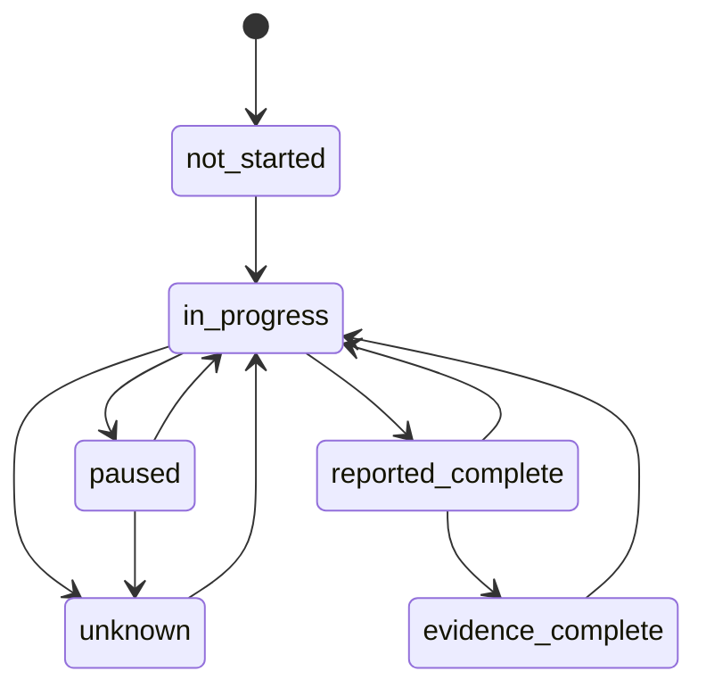

# M1 Synthetic Shutdown Handover Contract v1

## Question

What minimum evidence state must an incoming supervisor receive about a synthetic shutdown work front?

## Audience and unit

- **Portfolio audience:** client, recruiter, or company evaluating the work.
- **Synthetic operational persona:** incoming supervisor.
- **Canonical unit:** work front, grouping one or more tasks and dependencies.

## State model

The work-front state is deliberately not a simple complete/incomplete flag.

| State | Meaning |
|---|---|
| `not_started` | No progress is asserted |
| `in_progress` | Work is reported as active |
| `paused` | Progress stopped and context must be handed over |
| `reported_complete` | Completion is reported but evidence is not yet sufficient |
| `evidence_complete` | Every material assertion is supported or explicitly not applicable |
| `unknown` | The available record cannot support a state |

An assertion separately declares its evidence disposition:

- `supported`
- `pending`
- `conflicting`
- `missing`
- `not_applicable`

This separation prevents a reported state from silently becoming an evidenced state.

## Handover lifecycle



The lifecycle represents information state, not permission to perform work.

## Contract invariants

1. Every record and evidence item is marked synthetic.
2. Every assertion declares an evidence disposition and at least one limitation.
3. `supported` assertions reference at least one declared evidence item.
4. `conflicting` assertions reference at least two declared evidence items.
5. Every evidence reference resolves inside the record.
6. `evidence_complete` requires every assertion to be `supported` or `not_applicable`.
7. Shift start precedes shift end; handover occurs inside or at the end boundary.
8. Authority flags are always false.
9. Known authorization phrases are rejected anywhere in the record.
10. The incoming view exposes a headline, priority condition, blockers, next actions, owners, and timing.

## Forbidden interpretation

A valid record cannot establish that:

- an isolation is confirmed;
- a permit is approved;
- an area is safe;
- a person is authorized to proceed;
- work is ready to start.

The fixed authority statement is:

> Evidence record only. Follow site procedures and competent-person authority.

## Example coverage

Valid fixtures cover:

1. evidence-supported progress;
2. reported completion with pending evidence;
3. conflicting evidence;
4. unknown state after an evidence gap;
5. paused work front with a blocker and owned next action.

Invalid fixtures demonstrate:

1. an authority claim;
2. a supported assertion without evidence;
3. a false synthetic provenance marker.

## Run

```bash
python scripts/validate_handover.py examples/valid
python -m unittest discover -s tests -v
```

The validator uses only the Python standard library. The JSON Schema documents the portable structural contract; the validator adds semantic invariants.

## Non-claims

M1 is designed and tested synthetically. It is not deployed, site-approved, safety-qualified, or integrated with a real shutdown workflow.
